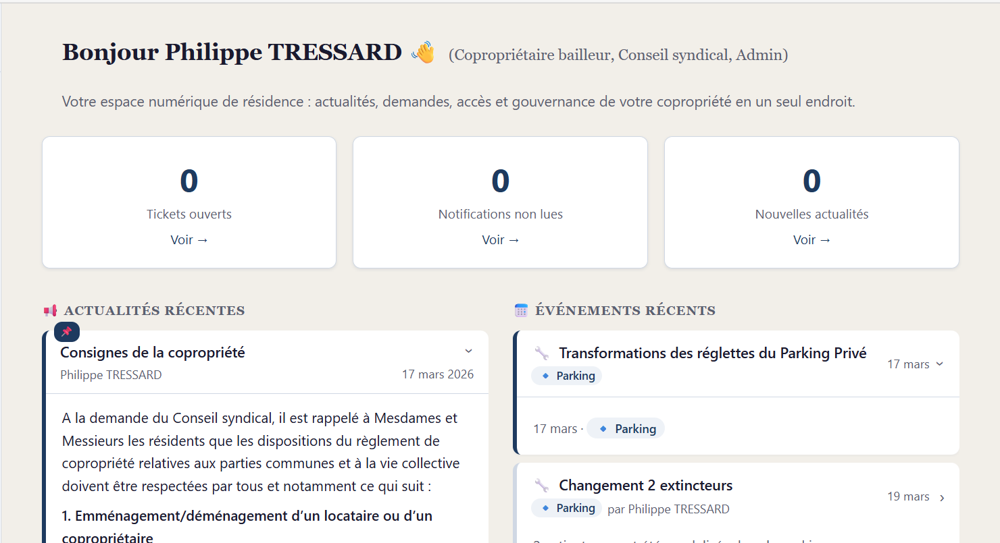
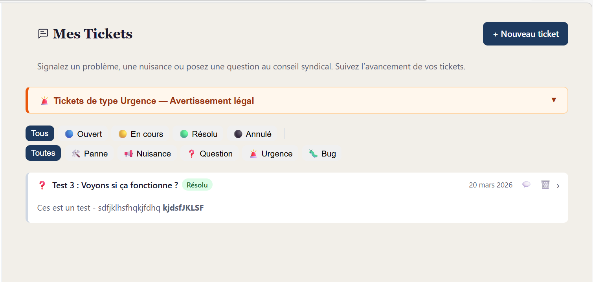
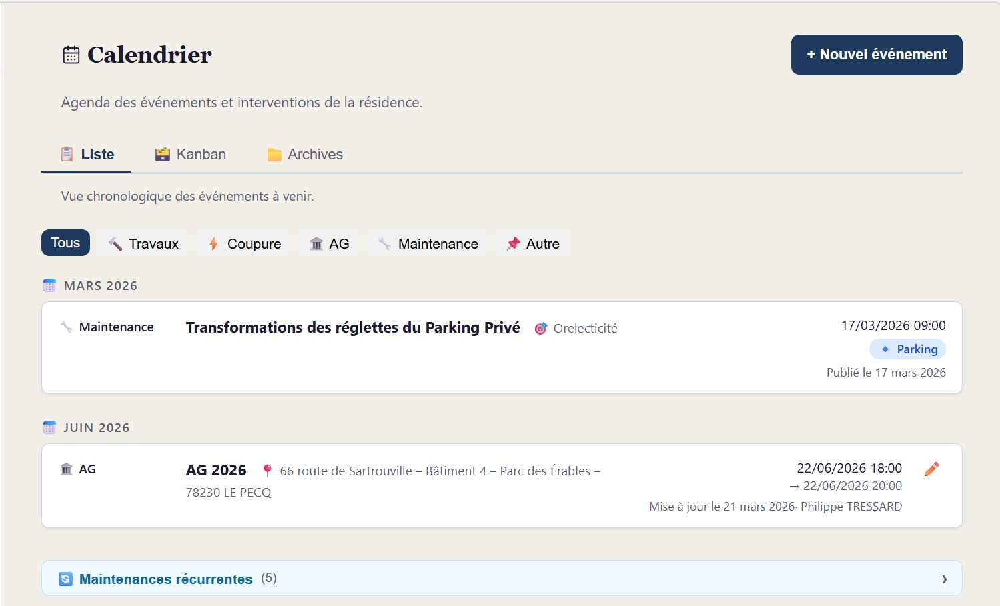
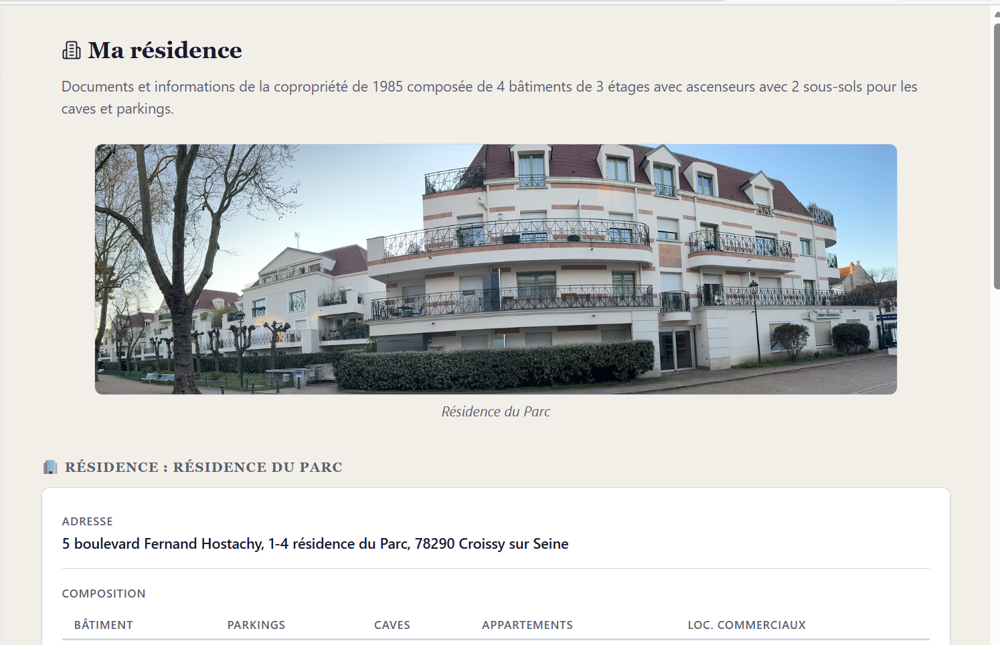
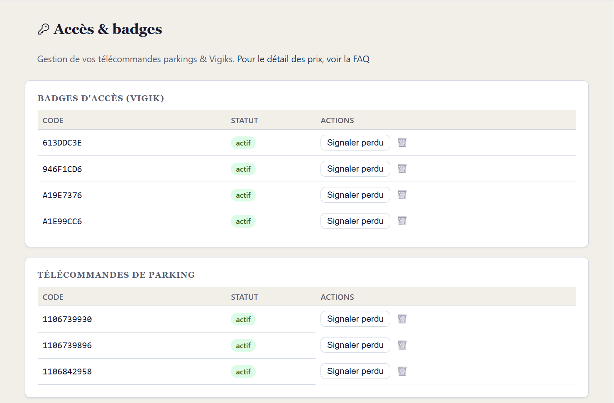
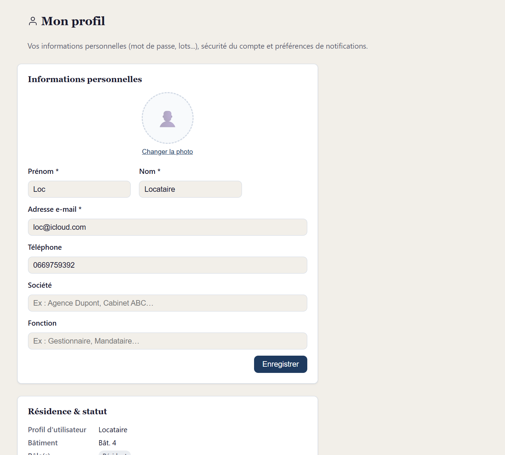

<p align="center">
  
</p>

<h1 align="center">5Hostachy</h1>

<p align="center">
  <em>Application web de gestion de copropriété — côté résidents et conseil syndical.</em>
</p>

<p align="center">
  <a href="LICENSE"></a>
  <a href="https://api.reuse.software/info/github.com/philippe-tressard/5hostachy"></a>
  
  
</p>

---

> **Votre résidence a désormais son appli.**
> Signalez un problème, suivez les travaux, consultez vos documents, commandez un badge ou échangez entre voisins — tout se fait depuis un seul espace, sécurisé et accessible 24 h/24.

## Fonctionnalités

- **Tableau de bord** — Actualités, événements, sondages
- **Tickets / Demandes** — Signalements avec suivi par le conseil syndical
- **Calendrier** — Événements, AG, travaux (vue liste + Kanban)
- **Documents** — GED avec catégories et accès par profil (résidents, propriétaires, CS)
- **Mon lot** — Informations du lot, baux, diagnostics
- **Accès & Badges** — Commande de télécommandes / badges Vigik, transfert bailleur → locataire
- **FAQ** — Questions fréquentes filtrées par profil utilisateur
- **Communauté** — Annuaire résidents, boîte à idées, sondages
- **Prestataires & Contrats** — Gestion des prestataires et contrats d'entretien
- **Administration** — Paramétrage site, comptes, sauvegardes, SMTP, WhatsApp
- **WhatsApp** — Notifications automatiques programmées vers le groupe de la résidence
- **Maintenance** — Tâches automatiques (purge tokens, archivage, logs) + déclenchement manuel

## Captures d'écran

<details>
<summary>Voir les captures</summary>

| Tableau de bord | Créer un ticket | Calendrier |
|:---:|:---:|:---:|
|  |  |  |

| Résidence | Accès & badges | Profil |
|:---:|:---:|:---:|
|  |  |  |

</details>

## Stack technique

| Composant | Technologie |
|---|---|
| Backend | [FastAPI](https://fastapi.tiangolo.com/) · SQLModel · SQLite (WAL) · Alembic |
| Frontend | [SvelteKit](https://kit.svelte.dev/) · TypeScript · Vite |
| Reverse proxy | [Caddy](https://caddyserver.com/) |
| Messaging | WhatsApp Bridge (Baileys) |
| Déploiement | Docker Compose · Raspberry Pi 5 |
| CDN / Tunnel | Cloudflare Tunnel + Worker (maintenance page) |

```
5hostachy/
├── api/               # Backend FastAPI
│   ├── app/           # Code applicatif (routers, models, utils)
│   └── alembic/       # Migrations de base de données
├── front/             # Frontend SvelteKit
│   └── src/routes/    # Pages de l'application
├── whatsapp-bridge/   # Bridge WhatsApp (Node.js)
├── specs/             # Spécifications fonctionnelles
├── docs/              # Documentation déploiement & ops
└── docker-compose.yml
```

## Démarrage rapide

### Prérequis

- [Docker](https://docs.docker.com/get-docker/) & Docker Compose v2+
- Git

### Installation

```bash
git clone https://github.com/philippe-tressard/5hostachy.git
cd 5hostachy

# Configurer l'environnement
cp .env.example .env
# Éditer .env : renseigner SECRET_KEY (min 32 chars), DOMAIN, ORIGIN

# Lancer
docker compose up --build -d
```

L'application est accessible sur `http://localhost`.

Au premier lancement, un compte admin est créé avec un **mot de passe aléatoire** affiché dans les logs :

```bash
docker compose logs api | grep "ADMIN INITIAL"
```

> **Changez immédiatement le mot de passe** après la première connexion.

### Développement local (sans Docker)

```bash
# Backend
cd api && python -m venv .venv && source .venv/bin/activate
pip install -r requirements.txt
uvicorn app.main:app --reload

# Frontend (autre terminal)
cd front && npm install && npm run dev
```

## Configuration

Toute la configuration se fait via le fichier `.env` (voir [.env.example](.env.example)).

| Variable | Description | Défaut |
|---|---|---|
| `SECRET_KEY` | Clé JWT — **obligatoire**, min 32 caractères | *(rejeté si non défini)* |
| `DOMAIN` | Domaine public | `example.com` |
| `ORIGIN` | URL complète du site | `https://example.com` |
| `COOKIE_SECURE` | `true` en prod HTTPS, `false` en dev HTTP | `true` |
| `MAIL_ENABLED` | Activer les notifications email | `false` |
| `WHATSAPP_API_KEY` | Clé d'authentification du bridge WhatsApp | *(optionnel)* |
| `ENABLE_API_DOCS` | Exposer `/docs` et `/redoc` | `false` |

## Documentation

| Document | Description |
|---|---|
| [specs/](specs/) | Spécifications fonctionnelles et techniques |
| [docs/deploy-rpi5-auto.md](docs/deploy-rpi5-auto.md) | Déploiement automatique sur Raspberry Pi 5 |
| [docs/restauration-complete.md](docs/restauration-complete.md) | Procédure de restauration complète |
| [docs/redondance-rpi5.md](docs/redondance-rpi5.md) | Architecture de redondance (failover) |
| [docs/cloudflare-worker-maintenance.md](docs/cloudflare-worker-maintenance.md) | Page de maintenance Cloudflare |

## Sécurité

- JWT avec cookies HttpOnly / Secure / SameSite=strict
- Hachage bcrypt des mots de passe
- Rate limiting sur les endpoints d'authentification (slowapi)
- Validation Pydantic / SQLModel sur toutes les entrées
- Headers de sécurité via Caddy (HSTS, X-Frame-Options, CSP)
- Sanitisation HTML côté client (DOMPurify)
- Protection path traversal sur les uploads

Voir [SECURITY.md](SECURITY.md) pour la politique de signalement de vulnérabilités.

## Contribuer

Les contributions sont les bienvenues ! Voir [CONTRIBUTING.md](CONTRIBUTING.md).

## Licence

[MIT](LICENSE) — Philippe TRESSARD — 2026
