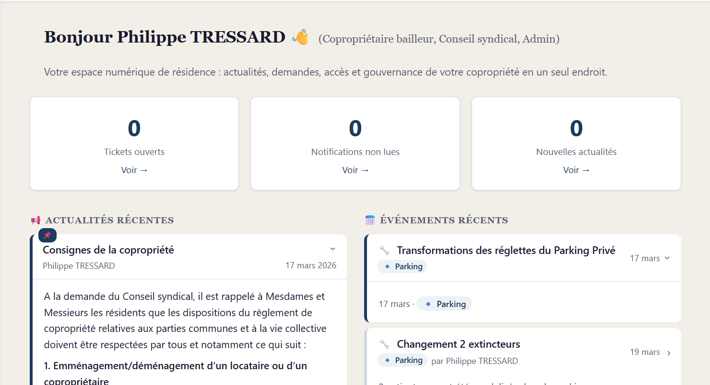
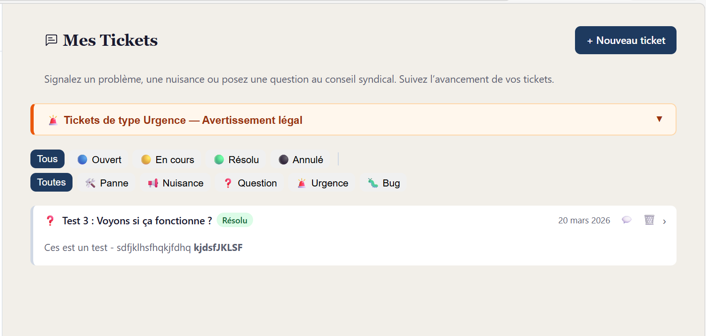
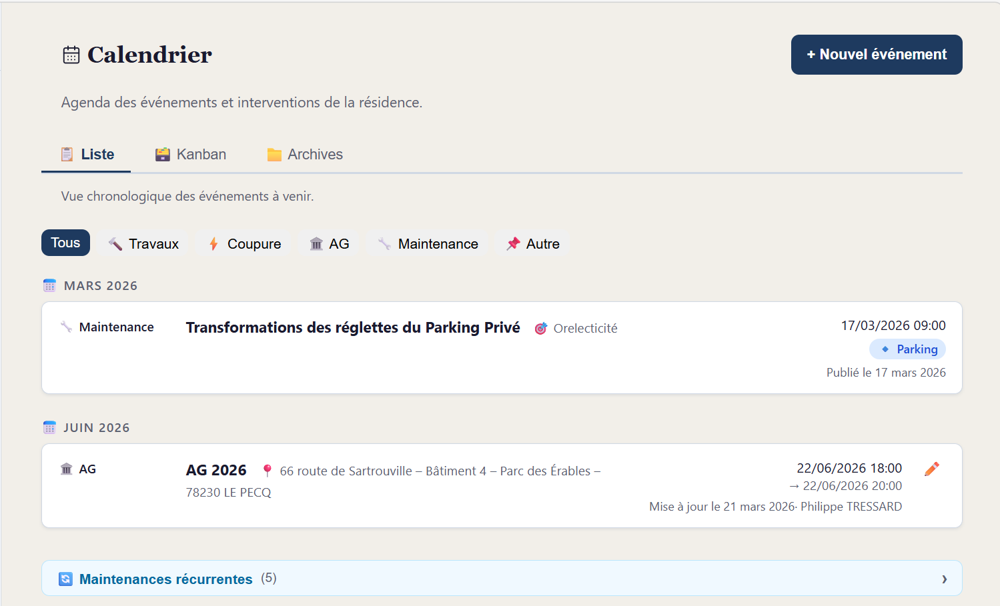
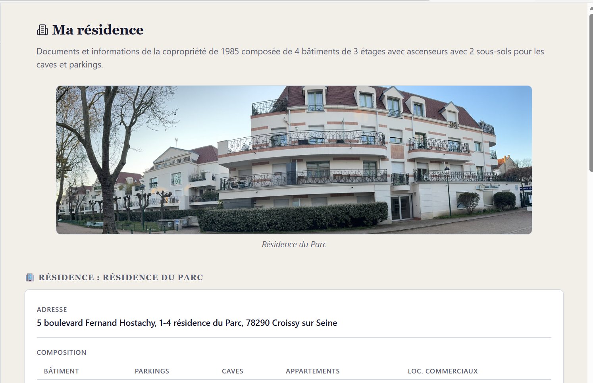
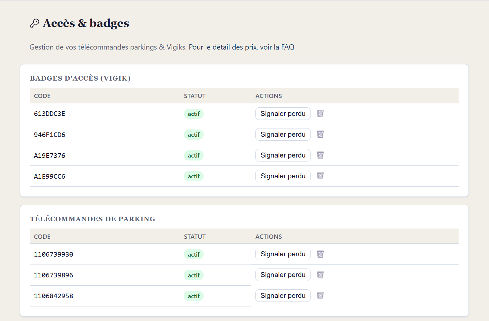
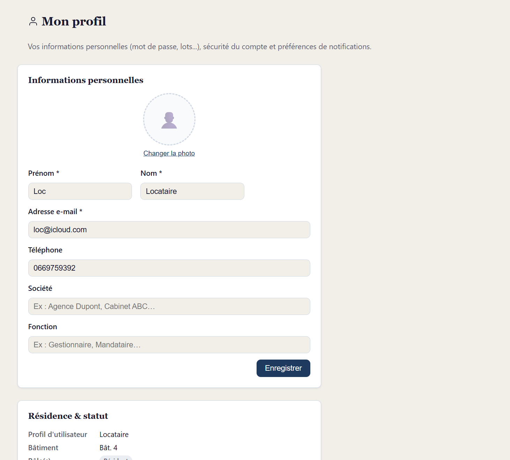

<p align="center">
  
</p>

<h1 align="center">5Hostachy</h1>

<p align="center">
  <em>Application web de gestion de copropriété — côté résidents et conseil syndical.</em>
</p>

<p align="center">
  <a href="https://github.com/philippe-tressard/5hostachy/actions/workflows/ci.yml"></a>
  <a href="LICENSE-5Hostachy.md"></a>
  <a href="https://api.reuse.software/info/github.com/philippe-tressard/5hostachy"></a>
  
  
</p>

---

> **Votre résidence a désormais son appli.**
> Signalez un problème, suivez les travaux, consultez vos documents, commandez un badge ou échangez entre voisins — tout se fait depuis un seul espace, sécurisé et accessible 24 h/24.

## Fonctionnalités

- **Tableau de bord** — Actualités, événements, sondages
- **Tickets / Demandes** — Signalements avec suivi par le conseil syndical. **Huit catégories**, chacune choisie parce qu'elle change *qui traite* : 🛠️ Panne (à réparer : ascenseur, chauffage, éclairage, fuite) · 📢 Nuisance & propreté · 🌳 Espaces verts · 💧 Sinistre (dégât des eaux, incendie, vandalisme — le syndic déclare à l'assurance sous cinq jours ouvrés) · 🏗️ Étude & travaux (le dossier long suivi par le conseil : diagnostic, sondage, devis, chantier — ces tickets-là entrent au **kanban** du Calendrier) · 🔑 Accès & accueil (interphone, boîte aux lettres, emménagement) · ❓ Question · 🐛 Bug. L'**urgence n'est pas une catégorie** mais une case à cocher : une panne peut être urgente, une nuisance aussi
- **Calendrier** — Événements, AG, travaux (vue liste + Kanban). Le **kanban** porte aussi les tickets de catégorie **🏗️ Étude & travaux**, rangés d'après leur statut (Ouvert → CS, En cours → Syndic, Résolu → Terminé, Annulé → Annulé) : un chantier se suit au même endroit que les événements qui le jalonnent. Le conseil syndical décoche la case au besoin. Ces cartes-là ne se déplacent pas à la souris — on fait avancer le suivi depuis le ticket, là où l'historique et les notifications suivent
- **Documents** — GED avec catégories et accès par profil (résidents, propriétaires, CS)
- **Carnet d'entretien** — l'histoire du bâti, obligatoire depuis le décret n° 2001-477 : ce qui a été entretenu, réparé et contrôlé, rangé **par équipement** et signalant les visites dont l'échéance est dépassée. C'est une **vue**, pas une saisie — il se constitue à partir des contrats d'entretien, des interventions terminées du calendrier et des tickets résolus qui concernent le bâti, et aucune donnée n'y est ressaisie. Onglet de *Résidence*, réservé aux copropriétaires, au conseil syndical et à l'administration. Le filtre par **périmètre** est pris dans l'arborescence administrée : un périmètre créé dans Admin → Patrimoine y apparaît sans déploiement, et un contrat déclare désormais ce qu'il couvre — un bâtiment, le parking, les caves ou toute la résidence
- **Mon lot** — Informations du lot, baux, diagnostics
- **Accès & Badges** — Commande de télécommandes / badges Vigik, transfert bailleur → locataire
- **FAQ** — Questions fréquentes filtrées par profil utilisateur
- **Communauté** — Annuaire résidents, boîte à idées, sondages et petites annonces, avec fil de réponses entre voisins (réponses du conseil syndical mises en avant) et notifications au créateur. Un sondage se cible comme une actualité : périmètre pris dans l'arborescence, et destinataires pris dans la liste commune (résidents, copropriétaires, copropriétaires occupants, bailleurs, locataires, conseil syndical). Une **petite annonce** porte elle aussi un périmètre — la résidence entière, un bâtiment, le parking, les caves — et se **corrige** après dépôt (titre, prix, catégorie, description) sans qu'il faille la supprimer et la redéposer, ce qui effaçait les réponses des voisins
- **Prestataires & Contrats** — Gestion des prestataires et contrats d'entretien, avec la **prochaine échéance de visite** de chaque contrat (en retard, à venir, sans échéance) et la **notation** de l'intervenant. Une intervention datée se suit dans le **Calendrier**, une demande au syndic par un **ticket**. Deux contrats sont **désignés** depuis la fiche de copropriété — l'**assurance** et le **mandat de syndic** — qui y affiche alors l'organisation, les dates, le numéro et le document signé. Le cabinet est un prestataire ; ses **membres** restent dans l'annuaire, d'où partent les e-mails
- **Annonces de hall** — Production d'une **affiche PDF** aux couleurs de la résidence pour les panneaux d'affichage, au **plus petit format qui accueille le texte** (A4 à A8, trait de découpe en dessous de l'A4). Elle se rédige directement ou se **pré-remplit depuis une actualité** (titre, contenu, périmètre, photos) — et **réciproquement** : une actualité se pré-remplit depuis une annonce de hall déjà produite, le conseil composant souvent l'affiche d'abord. Sa **diffusion** se choisit case par case comme partout ailleurs — groupe WhatsApp, syndic, conseil syndical, copie à soi —, toutes décochées d'origine : le conseil syndical du périmètre et le syndic reçoivent le PDF en pièce jointe, le groupe WhatsApp un lien vers l'actualité d'origine. Historique consultable, archivable, avec renvoi possible
- **Administration** — Paramétrage site, comptes, sauvegardes, SMTP, WhatsApp
- **Périmètres** — arborescence de la copropriété (bâtiments et leurs espaces, parking, AFUL, espaces verts, cheminements, locaux techniques) servant à localiser tickets, actualités, événements, **sondages** et annonces. Sur un ticket, il n'est pas figé à l'ouverture : une entrée du fil de suivi peut le **préciser** à mesure qu'on cherche, et l'historique garde la trace du resserrement. Entièrement éditable depuis l'administration, sans déploiement. Le périmètre dit *de quoi* il s'agit, pas *qui peut lire* — sauf sur une actualité marquée **🔒 Confidentiel**, où il redevient restrictif (lecture réservée au périmètre visé, affiche de hall alors impossible)
- **WhatsApp** — Notifications automatiques programmées vers le groupe de la résidence
- **Maintenance** — Tâches automatiques (purge tokens, archivage, logs) + déclenchement manuel,
  et le **contrôle de santé quotidien** (base, WhatsApp, sauvegardes, copie hors site, disque,
  modèles d'e-mail) relançable à la demande depuis l'écran
- **Liens partageables** — Chaque onglet et sous-onglet a son **adresse propre** (`/annonces`, `/idees`, `/calendrier/kanban`, `/mon-lot/location/archives`…) : l'adresse du navigateur suit ce qu'on regarde, elle se copie et s'envoie. Chaque publication porte une icône 🔗 qui copie **son** lien — annonce, actualité, événement, ticket, idée, sondage, question de FAQ, document, rapport de diagnostic. Le lien n'ouvre aucun droit : le destinataire doit être connecté et ne voit que ce qui le concerne. Les anciennes adresses (`?onglet=…`) restent servies, en redirection permanente

## Captures d'écran

<details>
<summary>Voir les captures</summary>

| Tableau de bord | Créer un ticket | Calendrier |
|:---:|:---:|:---:|
|  |  |  |

| Résidence | Accès & badges | Profil |
|:---:|:---:|:---:|
|  |  |  |

</details>

## Stack technique

| Composant | Technologie |
|---|---|
| Backend | [FastAPI](https://fastapi.tiangolo.com/) · SQLModel · SQLite (WAL) · Alembic |
| Frontend | [SvelteKit](https://kit.svelte.dev/) · TypeScript · Vite · PWA (installable ; écrans précachés, contenus toujours en ligne) |
| Reverse proxy | [Caddy](https://caddyserver.com/) |
| Messaging | WhatsApp Bridge (Baileys) |
| Déploiement | Docker Compose · Raspberry Pi 5 |
| Tests | pytest (API) · [Playwright](https://playwright.dev/) (navigateur, bureau et mobile) · une cinquantaine de contrôles `lint:*` sur la source |
| CDN / Tunnel | Cloudflare Tunnel + Worker (maintenance page) |

```
5hostachy/
├── api/               # Backend FastAPI
│   ├── app/           # Code applicatif (routers, models, utils)
│   └── alembic/       # Migrations de base de données
├── front/             # Frontend SvelteKit
│   ├── src/routes/    # Pages de l'application
│   └── e2e/           # Tests de navigateur (Playwright)
├── whatsapp-bridge/   # Bridge WhatsApp (Node.js)
├── scripts/           # Tous les scripts
│   ├── exploitation/  # Lancés par cron/systemd sur les RPi (bascule, failover…)
│   ├── lib/           # Modules sourcés par les précédents
│   ├── poste/         # Développeur et CI (pré-check, rejeu CI, export hors site)
│   └── installation/  # À lancer une fois sur un nœud neuf
├── infra/             # Code déployé ailleurs (worker Cloudflare)
├── specs/             # Spécifications fonctionnelles
├── docs/              # Documentation déploiement & ops
├── *.sh               # RELAIS temporaires vers scripts/exploitation/ : les
│                      #   crontabs désignent encore ces chemins. À retirer une
│                      #   fois les points d'entrée basculés (#337).
└── docker-compose.yml
```

## Démarrage rapide

### Prérequis

- [Docker](https://docs.docker.com/get-docker/) & Docker Compose v2+
- Git

### Installation

```bash
git clone https://github.com/philippe-tressard/5hostachy.git
cd 5hostachy

# Configurer l'environnement
cp .env.example .env
# Éditer .env : renseigner SECRET_KEY (min 32 chars), DOMAIN, ORIGIN

# Lancer
docker compose up --build -d
```

L'application est accessible sur `http://localhost`.

Au premier lancement, un compte admin est créé avec un **mot de passe aléatoire** affiché dans les logs :

```bash
docker compose logs api | grep "ADMIN INITIAL"
```

> **Changez immédiatement le mot de passe** après la première connexion.

### Développement local (sans Docker)

```bash
# Backend
cd api && python -m venv .venv && source .venv/bin/activate
pip install -r requirements.txt
uvicorn app.main:app --reload

# Frontend (autre terminal)
cd front && npm install && npm run dev

# Tests de navigateur (le serveur de dev démarre tout seul)
cd front && npx playwright install chromium && npm run e2e
```

> Les tests Playwright couvrent aujourd'hui les écrans **publics** — le reste du
> site est derrière une connexion. `front/e2e/README.md` dit ce qu'il faudrait
> décider pour aller plus loin, et pourquoi ce n'est pas un oubli.

## Configuration

Toute la configuration se fait via le fichier `.env` (voir [.env.example](.env.example)).

| Variable | Description | Défaut |
|---|---|---|
| `SECRET_KEY` | Clé JWT — **obligatoire**, min 32 caractères | *(rejeté si non défini)* |
| `DOMAIN` | Domaine public | `example.com` |
| `ORIGIN` | URL complète du site | `https://example.com` |
| `COOKIE_SECURE` | `true` en prod HTTPS, `false` en dev HTTP | `true` |
| `MAIL_ENABLED` | Activer les notifications email | `false` |
| `WHATSAPP_API_KEY` | Clé d'authentification du bridge WhatsApp | *(optionnel)* |
| `ENABLE_API_DOCS` | Exposer `/docs` et `/redoc` | `false` |

## Documentation

| Document | Description |
|---|---|
| [specs/](specs/) | Spécifications fonctionnelles et techniques |
| [docs/deploy-rpi5-auto.md](docs/deploy-rpi5-auto.md) | Déploiement automatique sur Raspberry Pi 5 |
| [docs/restauration-complete.md](docs/restauration-complete.md) | Procédure de restauration complète |
| [docs/redondance-rpi5.md](docs/redondance-rpi5.md) | Architecture de redondance (failover) |
| [docs/cloudflare-worker-maintenance.md](docs/cloudflare-worker-maintenance.md) | Page de maintenance Cloudflare |

## Sécurité

- JWT avec cookies HttpOnly / Secure / SameSite=strict
- Hachage bcrypt des mots de passe
- **Autorisation centralisée** — toutes les règles dans `api/app/auth/deps.py`, chaque endpoint en dépend, les rares exceptions publiques sont énumérées et justifiées (vérifié en CI)
- **Exposition publique en liste blanche** — ce qui est lisible sans authentification est énuméré, jamais déduit par exclusion
- Rate limiting sur les endpoints d'authentification (slowapi)
- Validation Pydantic / SQLModel sur toutes les entrées
- Headers de sécurité via Caddy (HSTS, X-Frame-Options, CSP)
- Sanitisation HTML côté client (DOMPurify)
- Protection path traversal sur les uploads
- **Vulnérabilités des dépendances vérifiées en CI** — `npm audit` sur tout l'arbre (`devDependencies` comprises : elles servent le site), seuil `low`, exceptions nominatives datées dans `front/audit-exceptions.json`

Voir [SECURITY.md](SECURITY.md) pour la politique de signalement de vulnérabilités.

## Contribuer

Les contributions sont les bienvenues ! Voir [CONTRIBUTING.md](CONTRIBUTING.md).

## Licence

**[Licence 5Hostachy](LICENSE-5Hostachy.md)** — Philippe TRESSARD, 2024-2026.

Code source **accessible**, copyleft fondé sur les principes de l'AGPLv3, avec
clauses commerciales. Les particuliers, associations, copropriétés et syndicats
de copropriétaires peuvent l'utiliser **gratuitement** ; tout usage commercial
requiert un accord préalable de l'auteur.

⚠️ Ce n'est **pas** une licence libre au sens de l'OSI, et elle n'est **pas**
compatible AGPLv3 : la clause commerciale ajoute une restriction que l'AGPLv3 §7
n'admet pas. Voir aussi [`NOTICE.md`](NOTICE.md).
